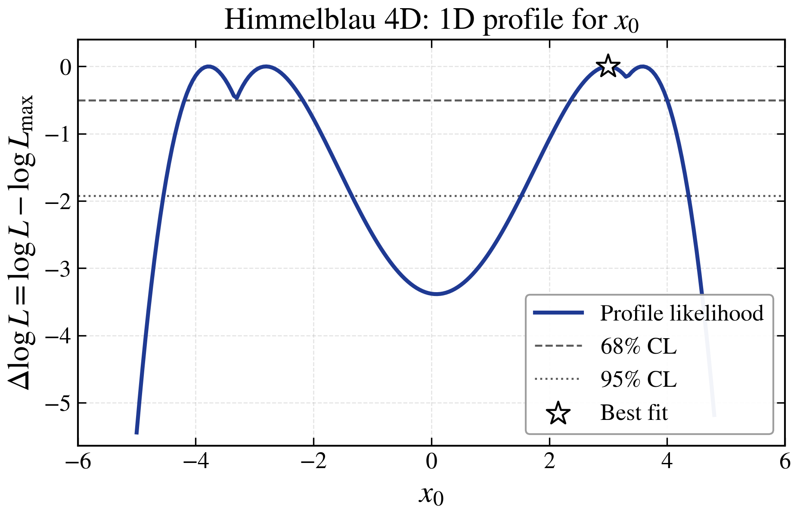
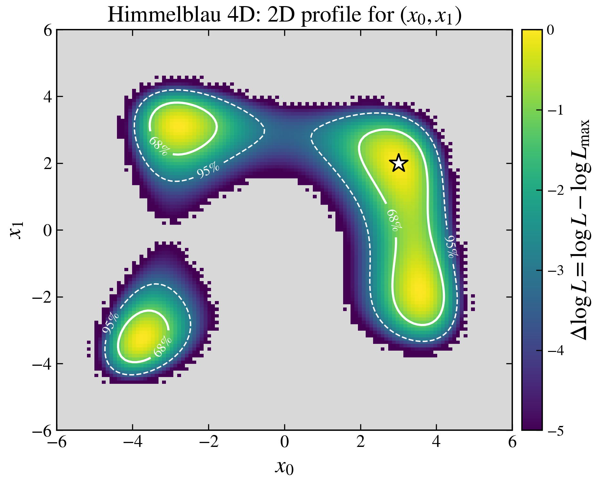
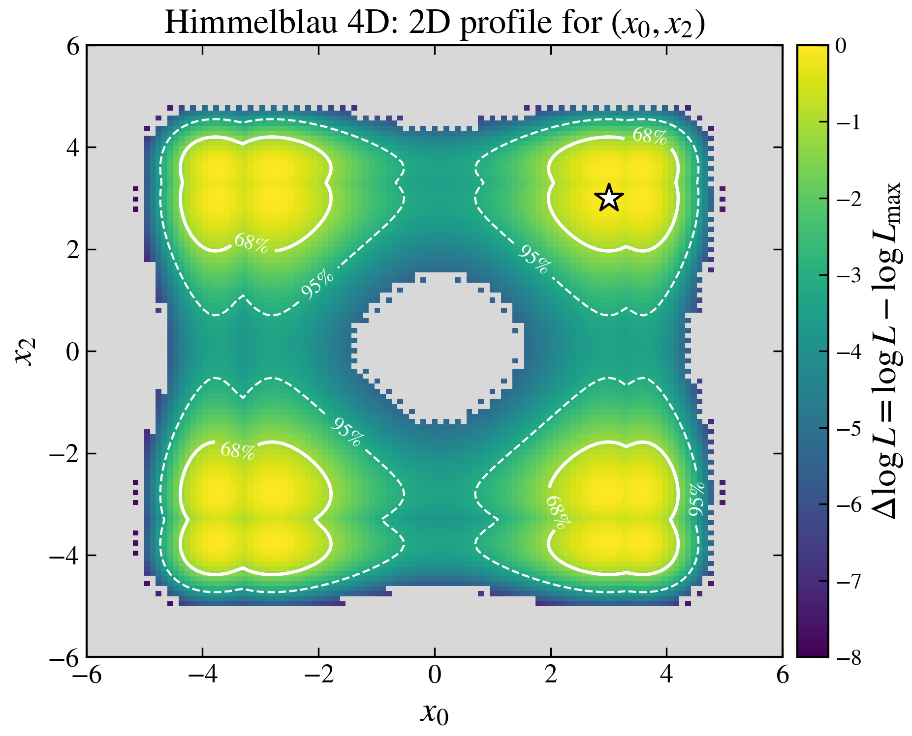
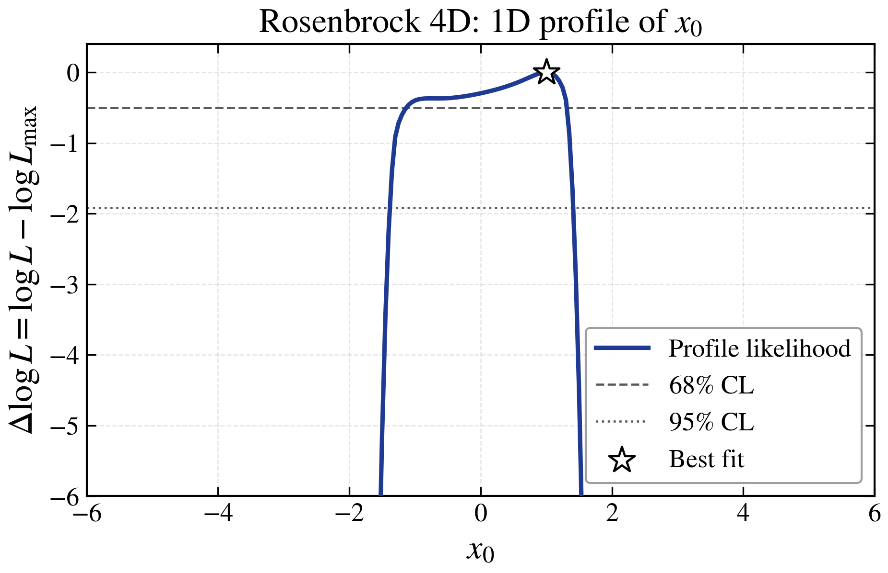
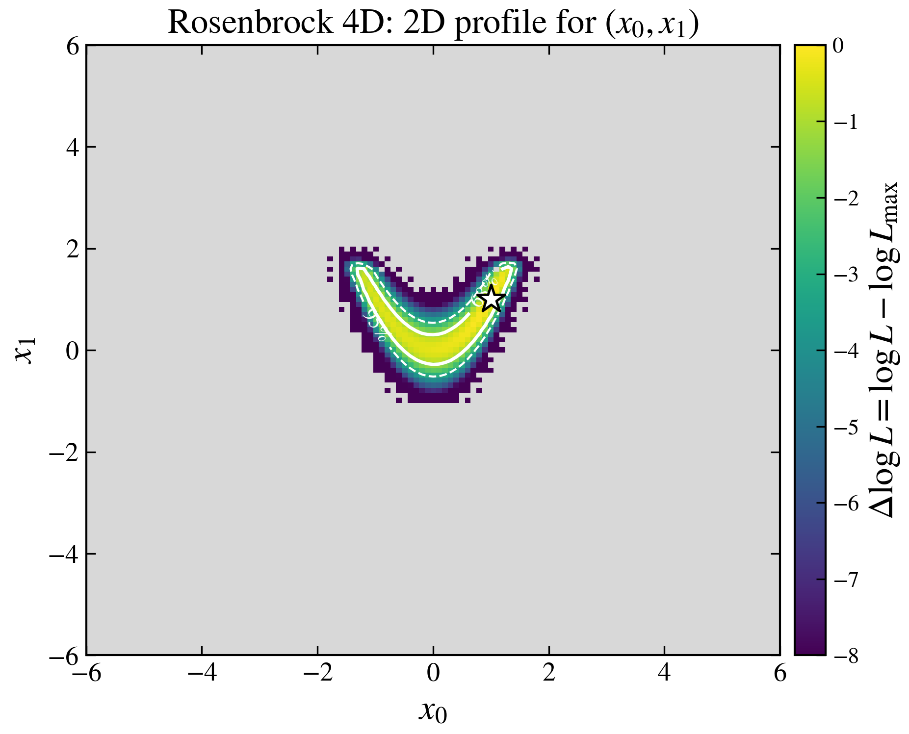
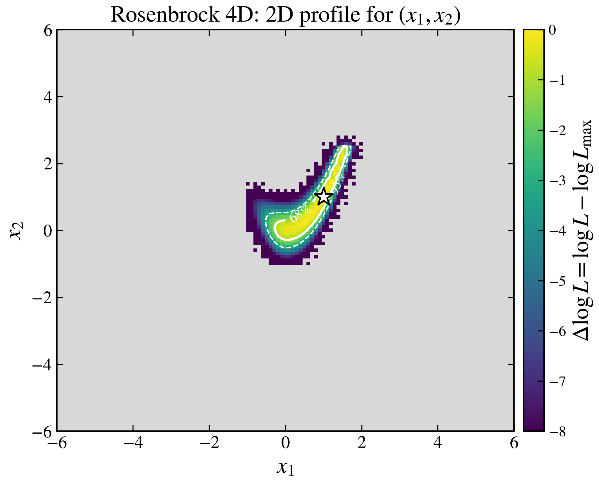
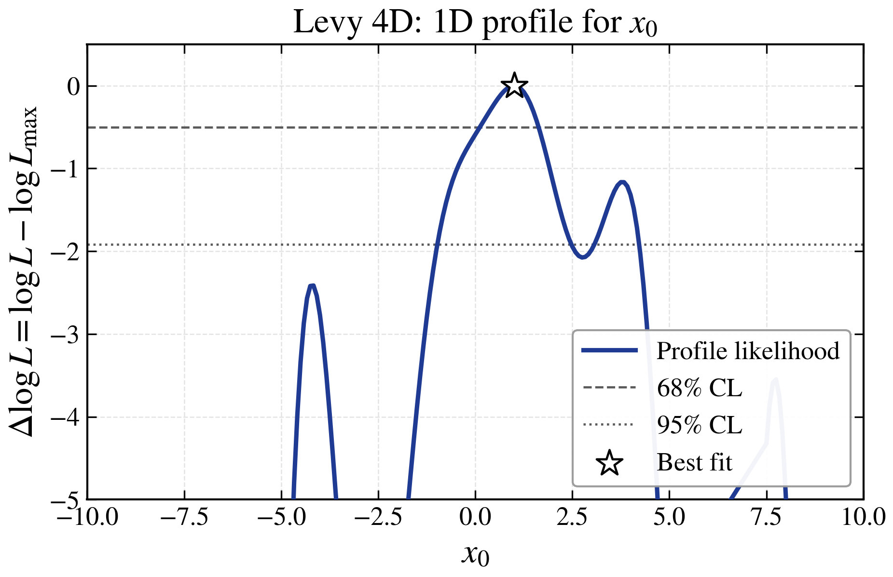
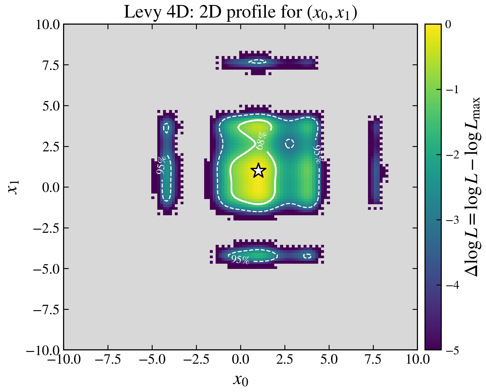
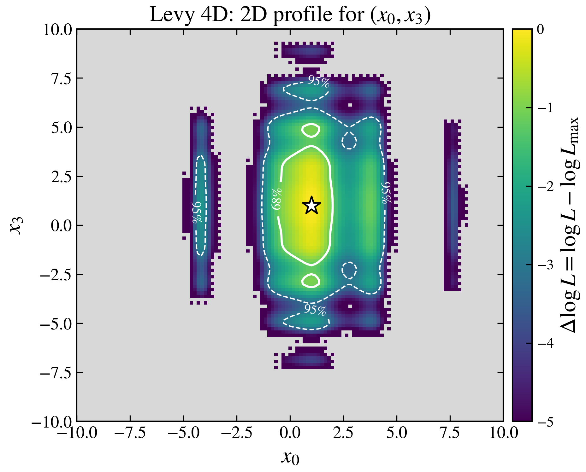

# ParaProf: Parallel profile likelihood computation

[](https://www.python.org/downloads/)
[](https://opensource.org/licenses/MIT)

**ParaProf** is a Python package for computing profile likelihood projections using parallelized grid-based optimization. It places populations on grid points and dynamically activates regions of interest, optimizing the remaining parameters at each grid point with differential evolution (DE) or L-BFGS-B.

<p align="center">
  
</p>

## Example output

The rows below show 1D and 2D profile likelihood projections produced by ParaProf for three 4-dimensional analytic test functions. At each grid point in a projection, the dimensions not shown are profiled out (optimized over) so that each plot reflects the best-fit log-likelihood over the unseen parameters. Contour lines mark the 68% and 95% Wilks confidence regions (Δχ² = 1, 3.84 in 1D and 2.30, 6.18 in 2D); the white star marks the best-fit grid point.

The plots were generated by `examples/run_showcase_scan.py` (one MPI scan per test function) followed by `examples/make_showcase_plots.py`.

<p align="center">
  
  
  
</p>

**Himmelblau 4D** — 264,617 target-function evaluations across all three projections.

<p align="center">
  
  
  
</p>

**Rosenbrock 4D** — 63,904 target-function evaluations across all three projections.

<p align="center">
  
  
  
</p>

**Levy 4D** — 117,757 target-function evaluations across all three projections. The last dimension uses a different oscillation form (`sin(2π·w₃)` instead of `sin(π·w + 1)`), so the (x₀, x₃) projection has noticeably denser horizontal ridges than the (x₀, x₁) projection.

## Key features

- **Parallel execution**: MPI-based master-worker architecture
- **N-dimensional projections**: 1D, 2D, 3D, and higher-dimensional profile likelihood grids
- **Adaptive sampling**: Dynamic grid activation focuses effort on high-likelihood regions
- **Grid refinement**: Interpolation-based refinement for increased resolution without full re-computation
- **Patching algorithm**: Wave-based refinement to escape local optima
- **Built-in visualization**: Plotting for 1D, 2D, and N-D projections
- **Benchmark suite**: Test functions (Himmelblau, Rosenbrock, Rastrigin, etc.)
- **Warm starting**: Reuse results across multiple projections, including in-memory cross-projection seeding of initial maxima and per-cell proximity warm-starts that inherit informative starting points from prior projections

## Installation

### Basic installation

```bash
pip install git+https://github.com/anderkve/paraprof.git
```

### With optional dependencies

```bash
# With visualization support
pip install -e ".[viz]"

# With development tools
pip install -e ".[dev]"

# With everything
pip install -e ".[all]"
```

### Requirements

- Python 3.10+
- NumPy
- SciPy
- mpi4py (requires MPI implementation like OpenMPI or MPICH)
- Matplotlib (optional, for visualization)
- scikit-learn (optional, for clustering during refinement)

## Quick start

### Minimal example

```python
from mpi4py import MPI
from paraprof import (
    ProfileProjector, run_all_projections, terminate_workers, worker_main,
    get_test_function,
)

comm = MPI.COMM_WORLD
myrank = comm.Get_rank()

log_likelihood, bounds, _ = get_test_function("himmelblau_4d")
projections = [
    {'dims': [0, 1], 'grid_points': [50, 50]},
]

if myrank == 0:
    with ProfileProjector(
        target_func=log_likelihood,
        bounds=bounds,
        projections=projections,
        roi_threshold=4.0,
        pop_per_grid_point=3,
    ) as sampler:
        comm.bcast(sampler.target_func, root=0)
        results = run_all_projections(
            comm=comm, sampler=sampler, projections=projections,
            save_plots=True,
        )
    terminate_workers(comm, myrank)
else:
    worker_main(comm, myrank)
```

Run with MPI:

```bash
mpiexec -n 4 python your_script.py
```

## How it works

### Algorithm overview

ParaProf uses a **grid-based optimization** strategy:

1. **Grid setup**: A regular grid is laid over the user-chosen subset of parameters; the remaining parameters are optimized at each grid point.
2. **Initial optimization**: Global L-BFGS-B finds starting maxima. On projections after the first, `initial_maxima` are seeded from the in-memory `global_solution_pool` accumulated by earlier projections, so the L-BFGS-B starts are skipped when prior coverage is sufficient.
3. **Population initialization**: A DE population (or a single L-BFGS-B start) is anchored at each promising grid point. One slot is filled with the highest-fitness past evaluation whose projection-dim coordinates are closest to the cell ("proximity warm-start"), so cells in later projections inherit informative starting points from the pool.
4. **Adaptive evolution**: DE (or L-BFGS-B) optimizes the profiled parameters at each active grid point.
5. **Neighbour curvature sharing (L-BFGS-B)**: Warm-starting grid point L-BFGS-B optimization using information from the best already-converged neighbour by seeding the quasi-Newton history (the `(s, y)` pairs that approximate the inverse Hessian) and trialling the neighbour's best profiled parameters as an alternative starting point. This way local curvature information propagates outward across the grid from already converged points.
6. **Dynamic activation**: Neighbours of high-likelihood grid points are automatically activated, expanding the active set within the region of interest.
7. **Patching**: Optional wave-based refinement re-tests each grid point with its neighbours' best profiled parameters and locally polishes any improvement found.
8. **Suspect recheck**: After patching, cells whose profiled parameters are discontinuous with their neighbourhood are re-optimized from diverse seeds — non-suspect neighbours, an extended Chebyshev ring, and the cross-projection pool — to crack contiguous wrong-optimum strips that patching's fitness-only filter cannot escape. Successive waves propagate fixes from the strip boundary inward.
9. **Refinement**: Optional grid-resolution increase, using interpolation of the coarse grid as warm-starts for the finer grid.

### Master-worker architecture

- **Master process** (rank 0): Orchestrates workflow, manages job queues, tracks convergence
- **Worker processes** (rank 1+): Evaluate target function in parallel, stateless execution

### Key components

- `ProfileProjector`: Central state manager and algorithm configuration
- `master_main()`: State machine coordinating the workflow
- `worker_main()`: Simple event loop for function evaluations
- Job classes: Asynchronous multi-step operations (L-BFGS-B, DE, activation, patching)

## Examples

The `examples/` directory contains demonstration scripts:

```bash
# Minimal scripts using just the core API (recommended starting point)
mpiexec -n 4 python examples/run_himmelblau_4d.py
mpiexec -n 4 python examples/run_rosenbrock_4d.py

# Power-user script that exercises the full advanced_config layout
mpiexec -n 4 python examples/run_himmelblau_4d_advanced.py
```

## Configuration

### Key parameters

These are the user-facing constructor arguments most scans actually need:

- `roi_threshold`: Region-of-interest cutoff in χ² units; cells with `logL > global_max - roi_threshold` are inside the ROI (default: 3.0)
- `pop_per_grid_point`: DE population size per grid cell (default: 3)
- `n_initial_optimizations`: Global L-BFGS-B starts before grid optimization (default: `min(100, 20 * n_dims)`)
- `max_patching_waves`: Cap on patching iterations (default: 10)
- `lbfgsb_max_iter`: Maximum L-BFGS-B iterations per polish (default: 50)
- `lbfgsb_polish`: Apply L-BFGS-B polish after DE convergence (default: True)
- `initial_points`: Optional array of starting points to activate explicitly, useful when prior knowledge of good regions exists (default: None)
- `use_clustering`: Detect multiple modes during refinement (default: True; only fires inside a refinement run with profiled dimensions)
- `refinement_direct_eval`: Skip optimization in the refinement run; just evaluate the interpolated point at each fine grid cell (default: False)
- `samples_output_file`: CSV path to log every evaluation (default: None)
- `warm_start_file`: CSV path read at the start of each projection to pre-populate `initial_maxima`, skipping the global L-BFGS-B seeding step (default: None). Set this equal to `samples_output_file` to round-trip the current run's samples into the next one.
- `grad_func`: Optional callable returning the gradient of `target_func` (default: None). See [User-supplied gradients](#user-supplied-gradients) below.

### User-supplied gradients

ParaProf normally estimates gradients via finite differences inside the L-BFGS-B paths, which costs N (forward) or 2N (central) extra target-function calls per gradient. If you have an analytic or otherwise cheap gradient — either fully or for some subset of dimensions — pass it via `grad_func` and ParaProf will skip the corresponding finite-difference evaluations:

```python
def target(p):
    return -float(np.sum(p**2))         # log-likelihood, maximized

def grad(p):
    return -2.0 * np.asarray(p)         # ∇target_func (NOT ∇objective)

sampler = ProfileProjector(target_func=target, grad_func=grad, ...)
```

**Sign convention.** `grad_func` returns the gradient of the function being **maximized** (i.e. `∇target_func`); ParaProf negates internally for the minimization objective. Getting this wrong sends L-BFGS-B uphill.

**Return formats.** Both are accepted:

- Length-`n_dims` array. Entries that are `NaN`, `+inf` or `-inf` are treated as "not provided" and filled in by finite differences using the configured `lbfgsb.gradient_method`.
- `{dim_index: value}` dict for partial gradients — dims not in the dict are filled in by finite differences.

**Scope.** Only L-BFGS-B paths use the gradient (initial global optimization, per-grid-point optimization, neighbour-curvature seeding, line-search backtracking, refinement, patching). Differential Evolution is gradient-free and is unaffected.

**Counters.** `sampler.target_calls_saved_by_user_gradient` tracks the FD target evaluations skipped because the user supplied that component. `sampler.user_gradient_errors` counts grad_func failures or shape mismatches that triggered FD fallback. Both are surfaced in the end-of-run summary log.

### Advanced configuration

Pass an `advanced_config` dict for expert tuning. Only keys that move solution quality or are real iteration budgets are exposed:

| Key                                | Default                        | What it does                                                     |
|------------------------------------|--------------------------------|------------------------------------------------------------------|
| `memory_size`                      | `max(grid_sizes) * 25`         | DE F/CR adaptation memory size                                   |
| `convergence_threshold`            | `1e-6`                         | DE per-cell convergence cutoff (tighter helps stiff valleys)     |
| `de.convergence_window`            | `3`                            | Generations of no-improvement before DE declares convergence     |
| `de.num_generations`               | `100000`                       | Hard cap on DE generations                                       |
| `de.max_num_to_evolve`             | `None` (all active cells)      | Cap on the number of cells evolved per generation                |
| `lbfgsb.ftol`                      | `1e-9`                         | L-BFGS-B function tolerance                                      |
| `lbfgsb.gradient_method`           | `'forward'`                    | `'forward'` (cheap) or `'central'` (more accurate, ~50% more calls) |
| `clustering.*`                     | (auto-DBSCAN)                  | Mode detection inside refinement runs (only when `use_clustering=True`) |
| `cross_projection.proximity_warm_start`       | `True`             | Per-cell activation pop swaps one random LHS seed for the highest-fitness past evaluation whose projection-dim coords are closest to the cell. Disable to fall back to pure random LHS seeding. |
| `cross_projection.pool_seeded_initial_maxima` | `True`             | On every projection after the first, seed `initial_maxima` from the in-memory pool and skip the `n_initial_optimizations` global L-BFGS-B starts. Disable to always re-run global L-BFGS-B at the start of each projection. |
| `suspect_recheck.enabled`                     | `True`             | Run the suspect-cell recheck pass after patching. Disable to skip entirely. |
| `suspect_recheck.max_waves`                   | `3`                | Cap on suspect-recheck waves (mirrors `max_patching_waves`). |
| `suspect_recheck.param_k`                     | `3.0`              | MAD multiplier for the profiled-param discontinuity threshold. Lower = more cells flagged. |
| `suspect_recheck.max_fraction`                | `0.25`             | Hard cap on the fraction of ROI cells flagged per wave. |
| `suspect_recheck.seeds_k_ring`                | `3`                | Max Chebyshev radius for extended-neighbour seed gathering. |
| `suspect_recheck.seeds_from_pool`             | `3`                | Number of cross-projection global-pool seeds to test per suspect cell. |
| `suspect_recheck.polish_threshold`            | `1e-4`             | Min logL improvement over the cell's current best to trigger the L-BFGS-B polish. |

See the constructor docstring of `ProfileProjector` for the full structure. Several DE knobs that did not change ROI grid quality in benchmarking (`mutation_strategy`, `pbest_fraction`, `neighbor_pull_probability`, `global_pool_size`, `patching.n_neighbors`, `activation.mix_ratios`) are now module-level constants in `sampler.py` and are intentionally not user-tunable.

### Projection options

Each projection is a dict. Required keys:

- `dims`: List of parameter indices to project
- `grid_points`: Grid resolution per dimension

Optional keys:

- `optimization_method`: `'de'` or `'lbfgsb'` (default: `'de'`)
- `patch_coarse_grid`: Enable patching on the coarse grid (default: `True`)
- `patch_refined_grid`: Enable patching on the refined grid (default: `False`)
- `grid_refinement_factor`: Integer multiplier; values > 1 enable a refinement run (default: no refinement)
- `refinement_method`: Interpolation method for refinement (default: `'linear'`)

## Visualization

ParaProf has a system for automatically generating some simple plots to check the results of a run.

### Profile likelihood plots

**1D profiles**
- Line plot with confidence levels (68%, 95%)
- Active grid point markers

**2D profiles**
- Heatmap with contour lines
- Customizable colorbars

**3D+ profiles**
- Pairwise 2D slice plots
- Maximum slice or marginalized views

### Profiled parameter plots

When `save_plots=True`, ParaProf also generates plots showing the optimal profiled parameter values across the projection space:

**1D projections**
- Multi-panel line plots showing how each profiled parameter varies along the projection dimension

**2D projections**
- Heatmaps (one per profiled parameter) showing the optimal parameter value at each grid point

**3D+ projections**
- 2D slice plots for each profiled parameter through the maximum likelihood point

These plots visualize which parameter values were selected by the profiling procedure at different points in the projection grid, helping you understand the parameter correlations and structure of the likelihood surface.

### Plot settings

```python
plot_settings = {
    'dpi': 300,
    'filetype': 'png',
    'slice_mode': 'max',  # or 'all' for marginalization (3D+)
    'vmin': -4.0,
    'vmax': 0.0,
    'plot_profiled_params': True,  # Enable/disable profiled param plots
}
```

## Testing

Run the test suite:

```bash
# Basic tests
pytest tests/ -v

# With coverage
pytest tests/ -v --cov=src/paraprof --cov-report=term-missing
```

## Development

### Project structure

```
paraprof/
├── src/paraprof/             # Source code
│   ├── sampler.py            # ProfileProjector class (state + algorithm config)
│   ├── master.py             # Master event loop / state machine
│   ├── worker.py             # Worker event loop
│   ├── jobs/                 # Job classes (LBFGSB, DE, activation, patching test)
│   ├── interpolation.py      # Grid interpolation + clustering for refinement
│   ├── visualization.py      # 1D/2D/N-D plot helpers
│   ├── nuisance_wrapper.py   # Wrap base test functions with nuisance parameters
│   ├── test_functions.py     # Himmelblau, Rosenbrock, Rastrigin, ... benchmarks
│   ├── exceptions.py         # Custom exception classes
│   └── logger.py             # Logging utilities
├── tests/                    # Test suite
└── examples/                 # Example scripts (`*_advanced.py` exercises advanced_config)
```

### Contributing

Contributions are welcome! Please:

1. Fork the repository
2. Create a feature branch
3. Add tests for new functionality
4. Ensure all tests pass
5. Submit a pull request

## License

This project is licensed under the MIT License - see the [LICENSE](LICENSE) file for details.

## Citation

If you use ParaProf in your research, please cite:

```bibtex
@software{paraprof2025,
  title = {ParaProf: Parallel Profile Likelihood Computation},
  author = {Kvellestad, Anders},
  year = {2025},
  url = {https://github.com/anderkve/paraprof}
}
```

---

**Maintainer**: Anders Kvellestad
**Python version**: 3.10+
